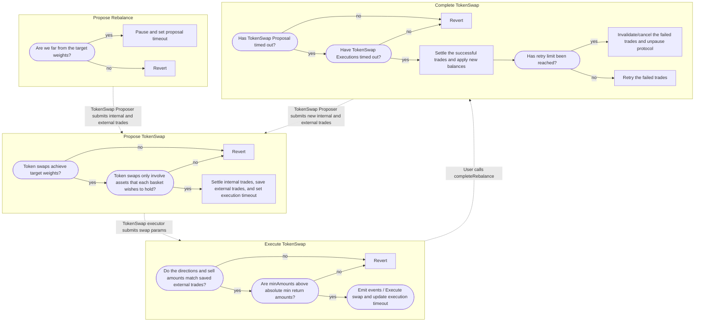
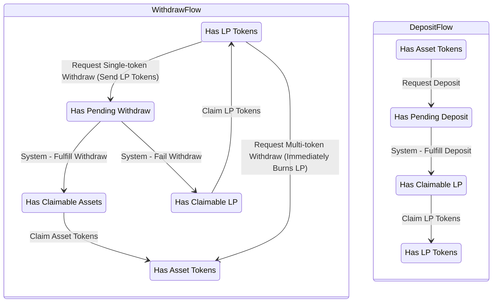
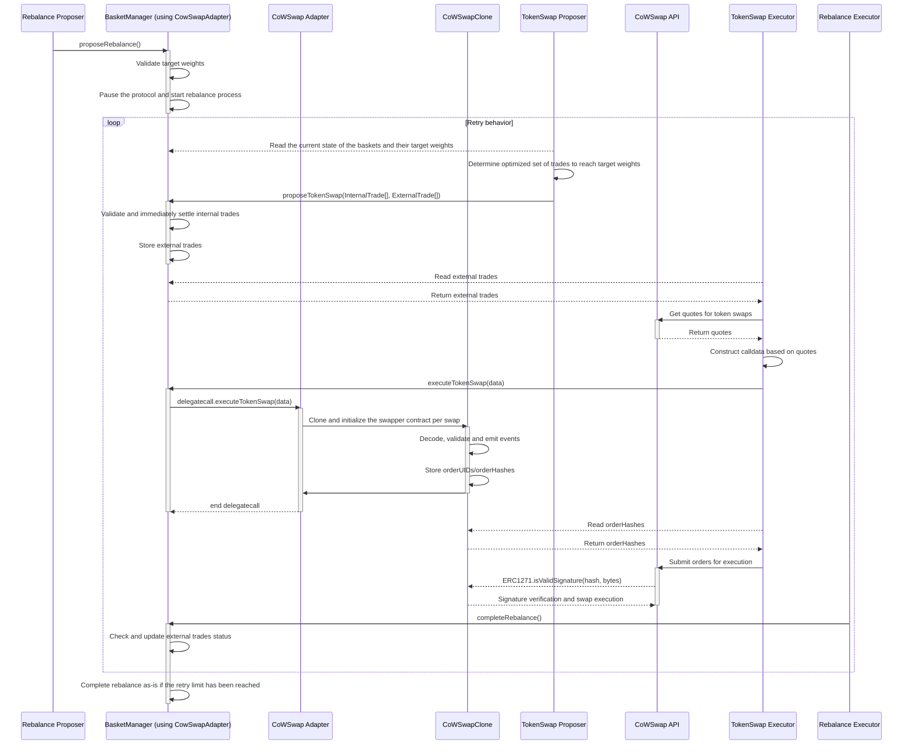
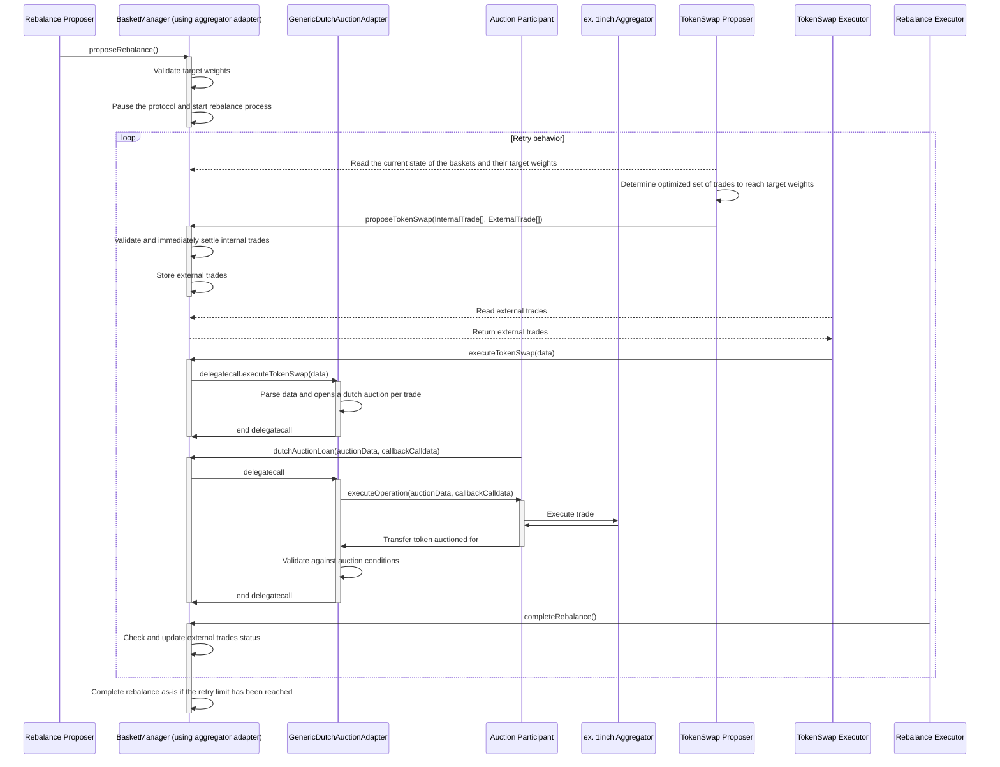

Cove is an asset management protocol designed to maximize returns through intelligent automation.  Cove simplifies complex strategies into accessible, yield-bearing products.

## Background

Traditional automated market makers (AMMs) are not well suited for portfolio or index construction because they suffer from [loss-versus-rebalancing (LVR)](https://a16zcrypto.com/posts/article/lvr-quantifying-the-cost-of-providing-liquidity-to-automated-market-makers/) due to [toxic order flow](https://insights.deribit.com/market-research/toxic-flow-its-sources-and-counter-strategies/) (i.e. all trades execute at worse-than-market prices).

> *"We found that for the 17 pools we analyzed, covering 43% of TVL and chosen by size, composite tokens and data availability, total fees earned since inception until the cut-off date was $199.3m. We also found that the total IL suffered by LPs during this period was USD 260.1m, meaning that in aggregate those LPs would have been better off by USD 60.8m had they simply HODLd."*
>
> Stefan Loesch, Nate Hindman, Mark B Richardson, Nicholas Welch: “Impermanent Loss in Uniswap v3”, 2021; [arXiv:2111.09192](http://arxiv.org/abs/2111.09192).

> *“Thus, providing liquidity has become a game reserved for sophisticated players with the introduction of Uniswap V3, where retail traders do not stand a chance.”*
>
> Lioba Heimbach, Eric Schertenleib, Roger Wattenhofer: “Risks and Returns of Uniswap V3 Liquidity Providers”, 2022; [arXiv:2205.08904](http://arxiv.org/abs/2205.08904). DOI: [10.1145/3558535.3559772](https://dx.doi.org/10.1145/3558535.3559772).

We propose an alternative solution that eliminates LVR and guarantees general intent level execution as a lower bound (e.g. CoW Swap).

This document introduces the BasketManager contract, which handles protocol deposits/withdrawals/LP tokens, custodying user assets, and managing the rebalance lifecycle. Storing user assets in one contract provides two major advantages from economies of scale: optimized/cheaper rebalancing (at the protocol level vs. for each basket) and increased value capture from matching trades internally.

## Summary

Cove functions as an intent aggregator for liquidity providers (LPs). Users express their intent by choosing a weight strategy and a combination of ERC-20/4626 tokens (represented as an LP token). These choices form a basket, such as Gauntlet-optimized yield strategy with sDAI/sFRAX, a market cap weighted index strategy with stETH/sfrxETH/yETH, or custom weights. This approach limits the number of options while allowing the protocol to aggregate deposits efficiently.  The weight strategy determines the weights of each token in a basket.  When the protocol rebalances, there is the potential for [coincidence of wants](https://en.wikipedia.org/wiki/Coincidence_of_wants) (CoW) to exist between baskets, like ring trades in [CoW Swap’s batch auctions](https://docs.cow.fi/overview/coincidence-of-wants).  Approximately maximizing the volume of CoWs given the current/target protocol level allocations is solvable off-chain with linear programming.  When there are matches, trades execute without leaking value (i.e. no price impact/slippage/fees/MEV from accessing exogenous liquidity).  External trades are routed through CoW Swap, which now supports programmatic orders including TWAP via their [Programatic Order Framework](https://blog.cow.fi/introducing-the-programmatic-order-framework-from-cow-protocol-088a14cb0375), to ensure the best execution and capture positive slippage.  The protocol includes configurable/switchable fees for management and internal trades.

To ensure safe rebalancing, BasketManager follows a sequence of proposing, executing, and finalizing a rebalance while temporarily pausing deposits and withdrawals for the affected baskets. As BasketManager pools assets for all Baskets, the rebalancing process considers each Basket's asset preferences and weight strategy. For example, when a new deposit arrives for a Basket with a limited token selection and a market cap weighted strategy, BasketManager deploys funds according to the respective weights, crediting the Basket for the new deposit without impacting other Baskets. Once the rebalance is complete, the tracked balances within BM are updated to reflect any changes resulting from swaps since the previous rebalance.

## Terminology

📄 Contract

👮 Permissioned Actor

🧑 Permissionless Actor

- **Smart Contract - BasketManager 📄**
    - The BasketManager contract is the core component of the Cove protocol, responsible for managing user deposits, withdrawals, and LP tokens. It also handles the rebalancing process, custody of user assets, and execution of trades. By pooling assets from all baskets, BasketManager enables efficient rebalancing and increased value capture through internal trade matching.
- **Smart Contract - BasketToken 📄**
    - Token representing BasketManager’s user deposits. Each BasketToken is defined and created with immutable selection of assets that will be considered for allocating and a weight strategy which determines the weights of the selected assets.  The maximum number of selected assets will be capped and configurable (e.g. start at 4 with a maximum of 8).
- **Smart Contract - WeightStrategy 📄**
    - Contract that each Basket is linked to for determining asset weights. Each weight strategy contract is associated with a single weight proposer who controls weight updates. Weights define the proportions of assets within a basket. Multiple baskets with varying asset selections can use the same WeightStrategy, provided the WeightStrategy supports all assets chosen by each basket.
    - When a Basket is created, an WeightStrategy address must be supplied.
- **Smart Contract - SwapAdapter 📄**
    - Adapters are modular contracts that are written to execute trades (e.g. via an aggregator or auction). BM can support both intent based aggregators and on-chain execution aggregators as long as their parameters/states are verifiable by BM.
    - Intent based aggregators that support smart contract signing via ERC-1271 are supported, such as CoW Swap.
    - A generic dutch auction adapter with a flash loan-like mechanism could be implemented such that any on-chain user-executable aggregator is compatible.  This also allows for easy deployment to other chains or L2s.
    - Another adapter could be used to swap more efficiently between 4626 tokens with the same underlying assets, or for lossless conversions between assets like USDC\<\>DAI using MakerDAO’s PSM.
- **Actor - Weight Proposer 👮/📄**
    - Actors responsible for updating their associated WeightStrategy contracts with the new weights for all baskets subscribed to it.
- **Actor - Rebalance Proposer 👮/📄**
    - Role that initiates the rebalance lifecycle.
- **Actor - TokenSwap Proposer 👮**
    - Calculates an optimized set of internal and external trades to execute in this rebalance and submits them to BasketManager.
- **Actor - TokenSwap Executor 👮**
    - Role that submits the calldata required to execute the submitted external trades.
    - If the Basket’s AggregatorAdapter is synchronous, TokenSwapProposer also executes the swaps.
- **Actor - Rebalance Executor 🧑**
    - Permissionless role that completes an ongoing rebalance and advances the epoch. Checks on the progress of the current rebalance are made.

## External Assumptions

- Dependent oracles do not report incorrect prices.
- BasketManager does not have on-chain access to live quotes from aggregators.
    - We assume the confidence intervals given by Pyth Oracles are sufficient to use. An oracle registry will be managed by the DAO and individual Oracle wrappers can be deployed to support additional operations (aggregating, applying 4626’s price per share, etc).
- TokenSwapProposer uses the ideal exchange rates derived from on-chain oracles instead of live quotes when generating the list of internal and external trades.
- RebalanceProposer will submit a set of internal and external trades that describes the changes in ALL baskets.
- Assets in BM are high quality (e.g. USDT, USDC, sDAI, sFRAX, stETH, cbETH) - liquid with low volatility and minimal instances of depegging.
- BasketManager is designed for standard ERC-20/4626 tokens, and is not concerned with the potential effects of rebasing or non-standard ERC-20/4626 implementations such as fee-on-transfer tokens.

## Entity–relationship model

<Frame>
  
</Frame>

## Rebalance lifecycle flowchart

## User actions flowchart

## Overview of the rebalancing sequence

1. Each **Weight Proposer** asynchronously updates any **WeightStrategy** instances that they manage.
    - Updates can be proposed until the rebalance starts.  For resolvers that have not been updated since the last rebalance, the prior target weights will be reused.
    - If a Weight Strategy’s methodology is difficult to prove or implement on-chain, the Weight Proposer for the strategy should be permissioned.

<Accordion title="Details (Click to expand)">
    - Permission
        - Only allowed addresses of each WeightStrategy can propose new basket weights.
    - Checks
        - The proposed weights only include values for the assets each basket is opted into.
        - The sum of proposed weights are equal to 1.
        - Weights of baskets managed by a different weight resolver cannot be modified.
    - Input:
        - Any necessary data to determine the new weights.
    - Output
        - Each **Weight Proposer** calls `WeightStrategy.setTargetWeights(uint256 bitFlag, uint256[] weights)`
            - Gas cost increases as the number of baskets increases
            - Piecemeal - Each rebalance proposer submits new weights for baskets of each allocation type
                1. WeightStrategyA = Gauntlet Optimized
                    1. Basket A,B weights
                2. WeightStrategyB = Seven Seas Capital Optimized
                    1. Basket C,D weights
                3. WeightStrategyC = market cap weighted
                    1. Basket E weights
                    2. No external dependencies, can be called JIT to generate
                    3. Methodology for calculating market cap can be deployed on-chain (store 4626’s totalAssets [= totalSupply * convertToAssets] * assetValue)
</Accordion>

2. **Rebalance Proposer (DAO)** calls `BasketManager.proposeRebalance()`.
    - Calculate the new total target token amounts based on each basket’s target weight.

<Accordion title="Details (Click to expand)">
    - Permissions
        - Could be permissionless with threshold limits.
    - Checks
        - Reads each basket’s current weight and target weight and then calculates the new protocol level state and measures the difference between the current/target states.
        - If the delta is less than some threshold, rebalance is not proposed.
            - $\sum_{i=1}^{n}\sum_{j=1}^{m} x_{ij} \ge L$
        - If the time since the last rebalance is less than some threshold, the rebalance is not proposed.
        - If there are pending deposits or redeems, the rebalance is proposed.
    - Input:
        - None
    - Output:
        - During `BasketManager.proposeRebalance()`
            - Each basket’s target weight is fetched from the WeightStrategy contract and stored as a hash in the BasketManager contract.
</Accordion>

3. **TokenSwap Proposer (DAO)** calculates the optimal swap pairs to reach the target amounts of each basket and calls `BasketManager.proposeTokenSwap(Trade[] internalTrades, Trade[] externalTrades)` to submit all necessary swap amounts and the associated basket and target weight information. BasketManager performs minimal on-chain validation to ensure the inputs align with each basket's target weights. If more advanced validation is needed, the role can be assigned to a separate contract using [Axiom](https://www.axiom.xyz/), transforming the process from a variable to a fixed cost.

<Accordion title="Details (Click to expand)">
    - The optimal internal trades and external trades should be calculated off-chain first.
    - Permission
        - Limited since the internal and external trades need to be optimized before submission.
    - Checks
        - Check if the each trade’s value change with slippage is within threshold (no apparent faulty swaps leading to value loss).
        - Check if the end state of baskets weights and protocol weight is within threshold.
        - Check if affected baskets include the tokens they are swapping from/to.
        - If possible, validate the methodology on chain.
    - Effects
        - Immediately settle all internal trades.
        - Store the external trades to be verified against swap params when executing the swaps at the next step.
            - For each external trade, the minimum of acceptable minAmounts is established with the exchange rate based on oracle prices of two assets multiplied by a slippage constant.
            - The constant that is applied for estimating price impact/slippage should be adjustable by the DAO.
            - Omit any external trades with low volume from being stored. The limit should be configurable by the DAO.
    - Input:
        - List of current token amounts.
        - List of target token amounts.
    - Output
        - Optimized set of internal trades and external trades to reach the target token amounts.
        - Calls `proposeTokenSwap(Trade[] internalTrades, Trade[] externalTrades)`.
</Accordion>

4. **TokenSwap Executor** uses quotes from the relevant API and then calls `BasketManager.executeTokenSwap(externalTrades, bytes data)` where the data is optional information required for the current token swap adapter.

<Accordion title="Details (Click to expand)">
    - Determines quotes from off-chain API and submits the slippage adjusted swap params to BM.
    - Permissions
        - Permissioned with allowlist that can be toggled.
        - Can be permissionless with sufficient checks in TokenSwapAdapter.
    - Inputs:
        - External trades that are proposed by TokenSwap Proposer.
    - Outputs:
        - Calls `executeTokenSwap(externalTrades, bytes data)` where the data is optional information used by the current token swap adapter.
            - `externalTrades.minAmount` is checked against the oracle value.
            - If using CoWSwapAdapter:
                - `data` is not used.
                - `externalTrades.minAmount` is used to create a cowswap order.
            - If using GenericDutchAuctionAdapter:
                - start amount, decrement steps, step durations.
                - begin dutch auction with the given parameters.
</Accordion>

5. If required, **TokenSwap Executor** submits orders to the off-chain API for execution (e.g. [CoW Swap API](https://api.cow.fi/docs/)).
    - Responsible for reading the stored orders from BM and submit them using off-chain API.
        - CoW Swap orders have unique IDs so once a trade is executed it can no longer be filled so replays or duplicate submissions are not problematic.

<Accordion title="Details (Click to expand)">
    - If BasketManager is configured with an on-chain aggregator such as 1inch, this step is not needed.
    - Inputs:
        - verifiedOrderHashes from BM contract storage and orders from emitted events.
    - Outputs:
        - Submits the orders to the CoW Swap API for execution.
        - Note that CowSwap will revert any orderHashes that fail ERC-1271’s isValidSignature check.
            - https://docs.cow.fi/tutorials/how-to-place-erc-1271-smart-contract-orders/good-after-time-gat-orders
</Accordion>

6. **Rebalance Executors** calls `BasketManager.completeRebalance` , executing any checks and validations needed to complete the rebalance and advance the epoch.
    - Responsible for completing rebalances and advancing the epoch.

<Accordion title="Details (Click to expand)">
    - Permission
        - Can be permissionless with sufficient checks at BM level.
    - Checks:
        - If target weights are not met within a specified tolerance, the rebalance enters a retry state. The rebalance status is set back to `REBALANCE_PROPOSED` and the token swap proposal process is restarted, allowing for additional iterations to converge closer to the target weights.
    - Inputs:
        - Current token balances.
        - Status of each external trade.
    - Outputs:
        - Calls `completeRebalance()`.
    - Effects:
        - Claims and records the result of any external trade orders.
        - Updates the BasketManager's internal accounting to reflect each basket's new token balances after the trades have been executed.
        - Advances the epoch.
</Accordion>

### Window timings and retries

After each step, the 15-minute window is reset. If the proposer role doesn't call within the window, then anyone can call `completeRebalance` to exit the rebalance process.

- `proposeRebalance`
    - Charges management fee and processes deposits for rebalancing baskets.
    - Determines target weights.
    - Opens a 15-minute window for `proposeTokenSwap`.
    - If proposer role doesn't call within the window, anyone can call `completeRebalance`.
- `proposeTokenSwap`
    - Settles internal trades and checks minimum amounts for external trades against on-chain oracle values.
    - Prolongs the ongoing rebalance window by an additional 15 minutes to allow sufficient time for swap execution.
    - If not called within the window, anyone can call `completeRebalance`.
- `executeTokenSwap`
    - Executes token swap with extra data if necessary.
    - After 15 minutes, anyone can call `completeRebalance`.
- `completeRebalance`
    - Checks if the current basket weights are within a specified tolerance of the target weights.
        - If not, retries up to 3 times, resetting the state as if `proposeRebalance` was just called.
    - If pending redemptions can't be fulfilled (not enough base asset), basket tokens are notified of the failed rebalance and users must claim shares back.

## Sequence diagrams

### CoW Swap adapter

### Generic dutch auction adapter

## Basket actions

### Creating a new Basket

Baskets are specified by their:

1. Combination of assets to be considered in the allocation.
2. Address of the weight strategy contract

The Basket is then deployed using `keccak256(uint256 selectionBitFlag, address weightStrategy)` as the salt, preventing duplicate deployments of the same config.  Creation of new basket is permissioned.

### Deposit/Mint

Deposits will be asynchronous and will be fulfilled at the start of each rebalance. Users can claim their shares after the next rebalance is finished.

- Users call `requestDeposit`
    - This transfers the base asset to the BasketManager contract.
- Protocol processes deposits at the next rebalance proposal, which transfers the base asset into the BasketManager, and credits the user's basket token contract with the corresponding shares.
- After the rebalance is finished, users who requested deposit can now claim their shares by calling `deposit` or `mint` functions.

### Redeem

Redeem will also be asynchronous if the user desires to receive the base asset only. Alternatively, we offer users to the ability to redeem basket tokens at any time for the their pro-rata allocation of the underlying tokens.

1. Synchronously
    - Users call `proRataRedeem`
        - Burn basket token from the user.
        - Transfer the currently allocated assets of the basket the user calculated pro-rata.
        - $q_{i} = BT_{burn} \times \frac{q_{i,total}}{B}$
        - where $q_{i,total}$ is the total quantity of the i-th token in the basket, and $B$ is the total supply of basket tokens.
    - Users receive a set of tokens instead of the base asset.
2. Asynchronously
    - Users initiate the process by calling `requestRedeem`, which transfers their basket token shares and requests these shares to be burned in exchange for the base asset.
    - Redeems are processed at the conclusion of the next rebalance. If the basket manager successfully acquires sufficient base assets, it transfers the corresponding base asset to each basket token contract and burns the requested basket token shares.
        - If the rebalance fails, after its completion, the users can call `claimFallbackShares` to retrieve their previously requested basket token shares.
    - Users who previously called `requestRedeem` can then call `redeem` or `withdraw` on the respective basket token contract to claim the underlying assets.

### Update bitFlag

The `BasketManager` contract allows the bitFlag of an existing basket to be updated through the `updateBitFlag` function. This function is restricted to only be callable by the `_TIMELOCK_ROLE`.

To update a basket's bitFlag:

1. Call `updateBitFlag(address basket, uint256 bitFlag)` with the following parameters:
   - `basket`: The address of the basket token to update.
   - `bitFlag`: The new bitFlag value. It must be a superset of the current bitFlag.

2. The function will perform the following checks:
   - The `basket` must exist and be registered in `basketTokenToIndexPlusOne`.
   - The new `bitFlag` must be different from the current one.
   - The new `bitFlag` must be a superset of the current bitFlag, meaning it includes all the bits set in the current bitFlag.
   - The basket's strategy must support the new `bitFlag`.
   - The new `basketId` (hash of `bitFlag` and `strategy`) must not already exist to prevent duplicate baskets.

3. If all checks pass:
   - The old `basketId` mapping is removed and the new one is added to `basketIdToAddress`.
   - The `basketAssets` for the basket are updated based on the new `bitFlag`.
   - The `BasketBitFlagUpdated` event is emitted with the old and new bitFlag values and IDs.
   - The `bitFlag` is updated in the `BasketToken` contract.

This process allows baskets to evolve over time by adding new assets while ensuring compatibility with the strategy and preventing duplicate baskets from being created.

## LP tokens

Cove will use the [ERC-7540](https://eips.ethereum.org/EIPS/eip-7540) standard for LP tokens. Since this is an ERC20, Uniswap’s [Permit2](https://github.com/Uniswap/permit2) will be compatible with the contract.

### Pricing LP tokens

#### Problems

Pricing the tokens of each Basket in terms of a single token is challenging because:
1. Each Basket can hold a diverse portfolio of assets.
2. The specific combination and quantities of assets held by a Basket can vary from one epoch to another due to rebalancing.
This dynamic nature of a Basket's composition makes it difficult to determine a straightforward price for its tokens at any given point in time.

#### Solutions

- Use oracle prices of base asset combined with 4626’s price per share:

    $$
    {BP}_{i}= \frac{\sum_{j=1}^{n} (q_{j} \cdot O_{j} \cdot P_{j})}{S_{i}}
    $$

    - $n$ = Number of different ERC-4626 tokens in the basket
    - $q_j$ = Quantity of the j*-*th ERC-4626 token in the basket
    - $O_j$ = Oracle price of the underlying asset of the j*-*th ERC-4626 token
    - $P_j$ = Price per share of the j*-*th ERC-4626 token in terms of the underlying asset
    - $S_{i}$ = Total supply of basket i
    - Does not reflect real value of basket tokens unless withdrawn pro-rata.

#### Risks

- This pricing will not account for execution costs for acquiring the assets thus relying on this could penalize depositors.
- This value is generated at the time user views the call.

## Rebalancing optimization with linear programming

### Problem

As number of baskets and available assets grows, it becomes not trivial to match intents. We will use linear programming to maximize the volume of internal trades. This minimizes losses (price impact/slippage) from accessing exogenous liquidity.

### Variables

Let:

- $B = \{b_1, b_2, \ldots, b_n\}$ be the set of baskets
- $A = \{a_1, a_2, \ldots, a_m\}$ be the set of assets
    - $a_{U}$ be USDT
- $IT = \{ (b_i, b_l, a_j, a_k) \mid b_i, b_l \in B, b_i \neq b_l, a_j, a_k \in A, a_j \neq a_k \}$ be the set of all possible internal trades between two different baskets
- $ET = \{ (b_i, a_j, a_k) \mid b_i \in B, a_j, a_k \in A, a_j \neq a_k \}$ be the set of all possible external trades
- $x_{ij}$ be the current holdings of asset $a_j$ in basket $b_i$
- $x_{ij}^*$  be the ideal target holdings of asset $a_j$ in basket $b_i$
- $T_{ijkl}$ be the internal trade variable representing the amount of asset $a_j$ to trade from basket $b_i$ for asset $a_k$ from basket  $b_l$
- $E_{ijk}$ be the external trade variable representing the amount of asset $a_j$ to trade from basket $b_i$ to an external party for asset $a_k$

### Determining Current Holdings

This would be the balances of each asset including USDT that each basket is currently holding. The amount of USDT is the new user deposits that have accrued since the last rebalance process.

### Determining Target Holdings

In order to determine the target holdings of assets, we need to account for users’ deposit requests and redeem requests. First we calculate how much ideal amount of USDT will be withdrawn from the basket. (Note that this is only an estimation and would not account for fees/slippage. The real amounts we end up with will vary based on slippage of each trade pairs). Since we know the total supply of the basket token and the amount of basket tokens submitted by the users for redeeming, the below formulae would be used for the target holding amounts.

- Let $V_i = \sum_{j=1}^{n}x_{ij} \cdot O_j \cdot P_j$
    - USD value of basket i before rebalancing, including the pending USDT deposit.

For the USDT target amount:

$x_{iU}^* = \left( \frac{BT_{i}^{redeeming}}{\text{S}_i} \right) \times  \dfrac{V_i - x_{iU}\cdot O_U}{O_U}$

For other assets’ target amounts:

${x}_{ij}^* = \left( V_i - x_{iU}^* \cdot O_{U} \right) \times \frac{\text{target weight}_j}{1} / (O_j \cdot P_j)$

Then after the rebalancing is successful, the resulting balance of USDT will be claimable by redeem requesters.

### Objective Function

The objective function balances the cost of internal and external trades, heavily penalizing the latter to encourage internal matches when possible.

We aim to minimize the volume of external trades with a higher penalty:

$$
\min Z = \alpha \sum_{(b_i, a_j, a_k) \in ET} E_{ijk} + \sum_{(b_i, b_l, a_j, a_k) \in IT} T_{ijkl}
$$

where $\alpha$ is a large penalty constant for external trades (e.g., $\alpha = 1000000$).

### Constraints

1. **No Negative Holdings After Internal Trades:**

    For each basket $b_i$ and each asset $a_j$:

    $x_{ij} + \sum_{l=1, l \neq i}^{n} \sum_{k=1, k \neq j}^{m} (T_{ljik} - T_{ijkl}) \geq 0$

    This ensures that no basket ends up with a negative quantity of any asset due to internal trades.

2. **External Trades Limited by Post-Internal Trade Balances:**

    For each basket $b_i$ and each asset $a_j$ :

    $\sum_{k=1, k \neq j}^{m} E_{ijk} \leq x_{ij} + \sum_{l=1, l \neq i}^{n} \sum_{k=1, k \neq j}^{m} (T_{ljik} - T_{ijkl})$

    This ensures that any external trades are limited by the available balance of the asset in the basket after accounting for internal trades.

3. **Target Holdings Met After All Trades:**

    For each basket $b_i$ and each asset $a_j$

    $x_{ij} + \sum_{l=1, l \neq i}^{n} \sum_{k=1, k \neq j}^{m} (T_{ljik} - T_{ijkl}) + \sum_{k=1, k \neq j}^{m} (E_{ijk} - E_{ikj}) \ge x_{ij}^*$

    $x_{ij} + \sum_{l=1, l \neq i}^{n} \sum_{k=1, k \neq j}^{m} (T_{ljik} - T_{ijkl}) + \sum_{k=1, k \neq j}^{m} (E_{ijk} - E_{ikj}) \le (1 + \epsilon )\cdot x_{ij}^*$

    This requires that the final holdings in each basket must match the target holdings after all trades have been completed.

4. **Trade Variables Non-Negative:**

    For all $T_{ijkl}$ and $E_{ijk}$:

    $T_{ijkl} \geq 0, \quad E_{ijk} \geq 0$

    This ensures that all trade variables are non-negative, which is a standard requirement in trade optimization problems to prevent nonsensical negative trades.

## Calculating deposits and redeems

- Let $V_i = \sum_{j=1}^{n}x_{ij} \cdot O_j \cdot P_j$
    - USD value of basket i before rebalancing, including the pending USDT deposit.
- Let $V_i^{*} = \sum_{j=1}^{n}x_{ij}^{*} \cdot O_j \cdot P_j$
    - Ideal USD value of basket i, using ideal target balances for each token.
- Let $V_i^{final} = \sum_{j=1}^{n}x_{ij}^{final} \cdot O_j \cdot P_j$
    - Actual USD value of basket i after all trades are successfully executed. This will be less then the ideal target balances due to slippage/costs.

First, the USDT that should be allocated for the requested redeems is calculated using the ideal exchange rate of the assets. Then we attempt to satisfy that the ideal USDT amount that should leave the basket.

Then after the swaps are executed, for each basket, the amount to mint for deposits are determined by measuring the change of value of the basket

- $BT_{i}^{minted} = (V_i^{final} - x_{i,USDT}^{final}\cdot O_{USDT}) - (V_i - x_{i, USDT} \cdot O_{USDT})$
    - In case any of the trades associated with redemption fails, we replace the withdrawn value with the sum of value of the assets that will be withdrawn via `proRataRedeem` method.

During a rebalance period where there are new deposits, the slippage associated with rebalancing will be paid by the depositors not the existing basket users.

In the ideal scenario, the prices at the end of the rebalance will not deviate greatly from the the beginning of the rebalance. In the case that it does, we use the latest oracle price to determine the depositors value.

## Fees

The protocol incorporates two types of fees: a configurable management fee for each basket and a global swap fee for internal trades. Both fees are measured in basis points (BPS) with a precision of 1e4.

### Management Fee

The management fee is calculated based on the time elapsed since its last computation, which occurs at the start of every rebalance cycle and when users exit via pro-rata redemption. The fee is determined using the following formula:

$$ fee = totalSupply \times managementFeeBps \times \frac{timeSinceLastHarvest}{1e4 \times 365 days} $$

Where:
- `totalSupply` is the current total supply of the basket token, excluding shares held by the fee collector or pending redemption.
- `managementFeeBps` is the management fee in BPS for the specific basket.
- `timeSinceLastHarvest` is the time elapsed since the last fee harvest.

The calculated fee is minted as new shares to the fee collector contract. The `FeeCollector` contract then divides the fee between the protocol treasury and the strategy sponsor according to the configured split percentage for each basket.

### Swap Fee

The swap fee is a global fee applied to all internal token swaps during rebalancing. It is charged on both the buy and sell tokens of each trade. The fee is calculated as follows:

$$ feeOnSell = sellAmount \times \frac{swapFeeBps}{2e4} $$
$$ feeOnBuy = buyAmount \times \frac{swapFeeBps}{2e4} $$

Where:
- `sellAmount` is the amount of the sell token being traded.
- `buyAmount` is the amount of the buy token being received (before fee deduction).
- `swapFeeBps` is the global swap fee in BPS.

The swap fees are accumulated in the `BasketManager` contract for each token and can be claimed by the protocol admin, which transfers the collected fees to the protocol treasury. The swap fee is not further divided and goes entirely to the treasury.

### Maximum Fees

The protocol enforces maximum values for both the management fee and swap fee to prevent excessive fees from being set. The maximum fees are as follows:

| Fee Type      | Maximum Value (BPS) |
|---------------|---------------------|
| Management Fee| 3,000 (30%)         |
| Swap Fee      | 500 (5%)            |

Note that while the maximum values are set to 100%, it is expected that realistic fee values will be significantly lower to ensure the competitiveness and sustainability of the protocol.

The management fee for each basket can be set individually by the protocol admin via the `setManagementFee` function in the `BasketManager` contract. The global swap fee can be set by the admin using the `setSwapFee` function in the same contract. Both functions enforce the respective maximum fee limits and can only be called by the protocol admin role.

## Oracles

Cove uses oracles to value baskets and settle internal trades.  Cove supports pluggable oracle implementations using the [euler-price-oracle](https://github.com/euler-xyz/euler-price-oracle) library (which adheres to [EIP-7726](https://eips.ethereum.org/EIPS/eip-7726)).

- Primary: Near real-time price oracle
    - Pyth (preferable for settling internal trades since real-time prices can be pulled for accuracy, cost permitting)
        - Pyth does not automatically submit the prices to the EVM networks: protocols and users are responsible for updating the on-chain Pyth price before using it. You may find a thorough explainer on the On-Demand Model in our [docs](https://docs.pyth.network/documentation/pythnet-price-feeds/on-demand).
- Secondary (anchor): Update threshold based oracle
    - Chainlink
- Other potential options include:
    - DEX TWAP or EMA oracles
        - Uniswap V3 TWAP
    - [Gyroscope’s Consolidated Price Feed (CPF)](https://twitter.com/Mrfti_plus/status/1717475859374682560)
        - Includes a [series of circuit breakers](https://docs.gyro.finance/gyroscope-protocol/oracles/consolidated-price-feed#circuit-breakers) to protect against faulty oracles.
    - [Chronicle protocol](https://chroniclelabs.org/dashboard)
        - Similar update cadence and limits as Chainlink

Oracles will primarily use [AnchoredOracle](https://github.com/Storm-Labs-Inc/cove-contracts-core/blob/master/src/AnchoredOracle.sol), a smart contract that implements a `PriceOracle` by retrieving quotes from a primary oracle and validating them against an anchor oracle. It ensures the primary quote is within a specified divergence range from the anchor quote before returning the price. This provides an additional layer of security against stale or manipulated oracle prices.

Assets that cannot be priced directly in USD will use a [CrossAdapter](https://github.com/euler-xyz/euler-price-oracle/blob/master/src/adapter/CrossAdapter.sol) with the base asset.

## Risks

- Managers of each WeightStrategy's gas payment increases as the number of baskets grow.
- Incorrect price calculation of a single asset could lead to incorrect accounting of the baskets.
- If Cove is unable to complete swaps to facilitate withdrawals users will be required to withdraw their assets in-kind.

## Monitoring and Emergency Functionality

Cove includes several features to monitor the system and respond to emergencies:

### Protocol and Asset Level Pausing

The protocol allows for pausing at both the protocol and asset level. When paused, all baskets that contain the paused asset will be affected, but pro-rata withdrawals are still allowed. This functionality is implemented in the `BasketManager` contract.

### Off-Chain Keepers for Oracle Price Monitoring

Off-chain keepers, such as OpenZeppelin Defender, will be used to monitor oracle prices in real-time. For example, if the price of USDT falls below 0.99, the keeper can automatically pause the protocol to prevent further issues.

### Real-Time Anomaly Detection Protocols/Services

Cove plans to integrate with real-time anomaly detection protocols and services, such as [Forta](https://forta.org/), which can help identify and respond to potential threats or unusual activity within the protocol. These services can monitor for a wide range of issues, including:

- Unexpected changes in asset prices
- Large or suspicious transactions
- Unauthorized access attempts
- Smart contract vulnerabilities

By leveraging these monitoring and emergency response features, Cove can quickly identify and mitigate potential risks, ensuring the safety and security of users' funds.

## Alternatives considered

- Rebalancing methods
    - Auctions
        - The problem with auction mechanisms for frequent rebalancing is as follows (from [Aera V1 Weight Update](https://docs.aera.finance/v1-archive/concepts/vault-guardian/weight-update)):
            - Auctions are overly sensitive to current market price,
            - Auctions restrict participation to larger pools of capital and infrastructure to identify and participate in the auction.
        - The main advantage from using an auction mechanism like Kuiper is removing the oracle dependency.  However, that dependency is already implicit since oracles are used to value basket tokens.  In theory, CoW Swap should offer better execution due to ring trades, and by outsourcing this functionality we can reduce the complexity of the protocol and tap into CoW Swap’s existing network of solvers.  Cove will also support using dutch auctions to rebalance via an adapter as a fallback.
        - Existing work
            - Kuiper (oracle-less) - https://kuiper.gitbook.io/kuiper-docs/protocol/rebalancing-auctions
            - Set (uses MakerDAO price feeds) - https://help.tokensets.com/en/articles/3399436-how-to-participate-in-set-protocol-rebalance-auctions
    - [Balancer’s Managed Pools](https://docs.balancer.fi/concepts/pools/managed.html) ([Aera V1](https://docs.aera.finance/v1-archive/concepts/aera-vault/balancer-managed-pool))
        - While it retains some benefits of TWAP’ing, still suffers from loss-versus-rebalancing.
- Omitting contract events and using shadow events for gas optimization ([Shadow](https://www.shadow.xyz/))
    - Seems like a premature optimization given how much tooling relies on events.

## Related work

- [Kuiper](https://kuiper.gitbook.io/kuiper-docs/)
- [Tokemak’s Autopilot v2](https://medium.com/tokemak/tokemak-v2-introducing-lmps-autopilot-and-the-dao-liquidity-marketplace-86b8ec0656a)
- [Gauntlet’s Aera v2](https://docs.aera.finance/how-aera-v2-works)
- [Definitive](https://docs.definitive.fi/)
- [Set](https://www.tokensets.com/)
- [Sandclock](https://www.sandclock.org/)
- [SUClave](https://github.com/getclave/suclave-ethglobal-istanbul/)
- [Indexed Finance](https://indexed.finance/)

## Acknowledgements

Special thanks to Joey Santoro (Variant), Tarun Chitra (Gauntlet), Ken Deeter (Electric), Saneel Srini (Accomplice), Peteris Erins (Auditless/Aera), Elliot Friedman (Solidity Labs), Storm Slivkoff (Paradigm), and Will Price for their feedback after reviewing drafts.
